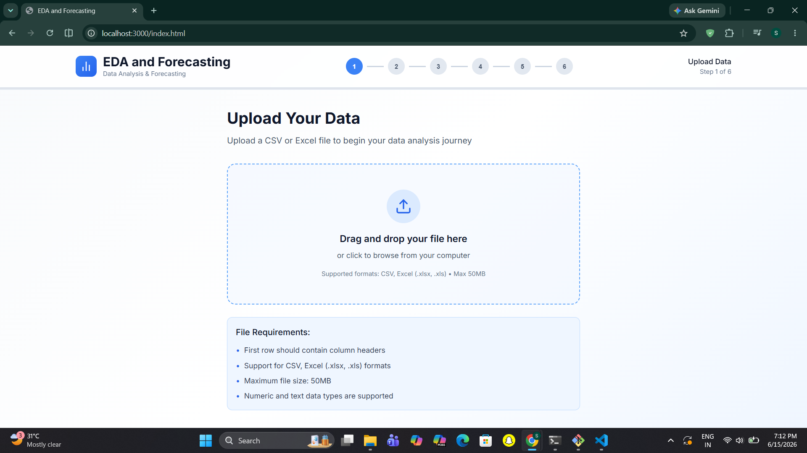
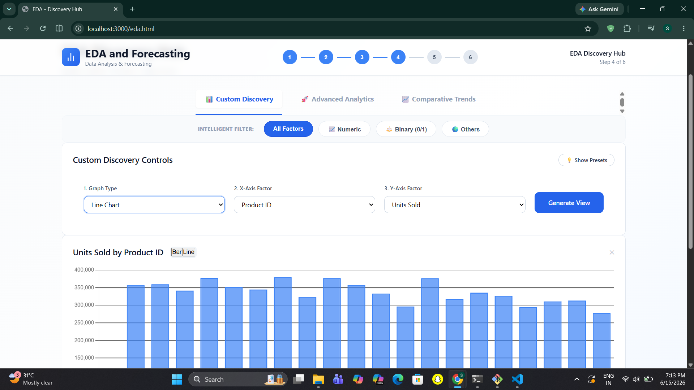
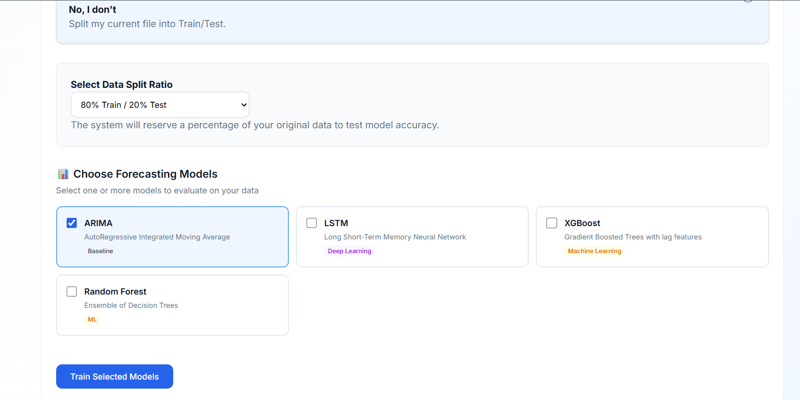
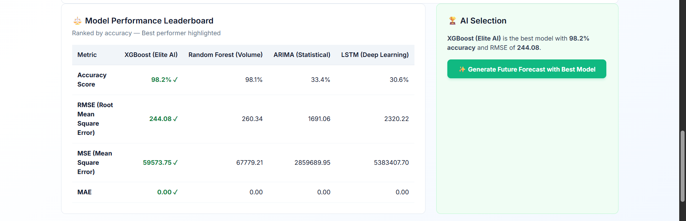
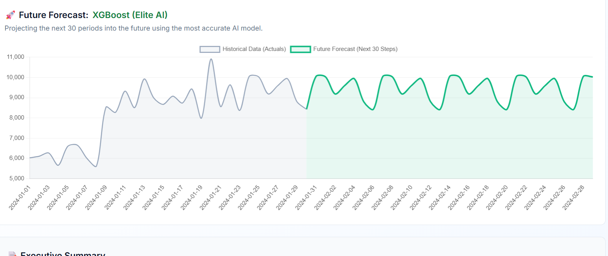

<div align="center">

# 🚀 Automated Time-Series Forecasting & Analysis Platform

### End-to-End Data Analytics, Forecasting & Visualization Solution

Built during my internship at EY (Ernst & Young)

</div>

---

## 🌟 Overview

This project is a full-stack forecasting platform that automates the complete workflow of time-series analysis.

From dataset upload to future prediction, the platform helps users analyze data, generate insights, compare multiple forecasting models, and obtain accurate forecasts through an interactive dashboard.

### Key Highlights

✅ Automated Data Preprocessing

✅ Interactive Exploratory Data Analysis (EDA)

✅ Multi-Model Forecasting Engine

✅ Dynamic Model Comparison Leaderboard

✅ Future Forecast Generation

✅ Modern Full-Stack Architecture

---

# 📸 Application Screenshots

## 📂 Dataset Upload & Data Import

<p align="center">

</p>

Upload datasets and automatically prepare them for analysis.

---

## 📊 Interactive EDA Dashboard

<p align="center">

</p>

Explore trends, distributions, correlations, and business insights through interactive visualizations.

---

## 🤖 Forecasting Dashboard

<p align="center">

</p>

Train multiple forecasting models and visualize predictions against actual data.

---

## 🏆 Model Performance Leaderboard

<p align="center">

</p>

Compare forecasting models using multiple evaluation metrics and identify the best performer automatically.

---

## 🔮 Future Forecast Generation

<p align="center">

</p>

Generate future predictions using the top-performing model.

---

# 🎯 Project Workflow

```text
Dataset Upload
      ↓
Data Exploration
      ↓
Data Preprocessing
      ↓
Exploratory Data Analysis
      ↓
Model Training
      ↓
Model Evaluation
      ↓
Leaderboard Ranking
      ↓
Future Forecast Generation
```

---

# ✨ Features

## 📂 Data Upload

- CSV Dataset Support
- Data Preview
- Automatic Column Detection

## 🔍 Data Exploration

- Dataset Overview
- Data Type Detection
- Column Analysis

## 🧹 Automated Preprocessing

- Missing Value Handling
- Duplicate Removal
- Outlier Detection
- Scaling & Normalization
- Intelligent Data Aggregation

## 📊 Exploratory Data Analysis

- Trend Analysis
- Weekly Analysis
- Monthly Analysis
- Product-wise Analysis
- Store-wise Analysis
- Correlation Heatmaps
- Interactive Filters

## 🤖 Forecasting Models

Implemented multiple forecasting approaches:

- ARIMA
- Prophet
- LSTM
- ETS
- XGBoost
- Random Forest

## 🏆 Model Evaluation

Performance comparison using:

- RMSE
- MAE
- MAPE
- Pearson Correlation

The system automatically selects the best-performing model.

## 🔮 Future Forecasting

- Future Trend Prediction
- Forecast Visualization
- Model-Based Forecast Generation

---

# 🏗 System Architecture

```text
Frontend (React + Next.js)
            │
            ▼
       FastAPI Backend
            │
 ┌──────────┼──────────┐
 ▼          ▼          ▼
EDA     Preprocessing Forecasting
Engine     Engine       Engine
            │
            ▼
     Model Evaluation
            │
            ▼
      Future Forecast
```

---

# 🛠 Tech Stack

<table>
<tr>
<td><b>Frontend</b></td>
<td>React, Next.js, TypeScript, Tailwind CSS</td>
</tr>

<tr>
<td><b>Backend</b></td>
<td>FastAPI, Python</td>
</tr>

<tr>
<td><b>Data Processing</b></td>
<td>Pandas, NumPy</td>
</tr>

<tr>
<td><b>Visualization</b></td>
<td>Recharts</td>
</tr>

<tr>
<td><b>Forecasting</b></td>
<td>ARIMA, Prophet, ETS, XGBoost, Random Forest, LSTM</td>
</tr>

<tr>
<td><b>State Management</b></td>
<td>Zustand</td>
</tr>
</table>

---

# 📈 Key Achievements

- Developed an end-to-end forecasting platform.
- Automated preprocessing and EDA workflows.
- Integrated multiple forecasting models.
- Built interactive dashboards for business insights.
- Implemented dynamic model ranking.
- Designed a scalable architecture for future AI integration.

---

# 🔮 Future Improvements

### 🧠 LLM-Powered Analytics

Integrate Large Language Models (LLMs) to automatically interpret EDA findings and forecasting results.

The platform will generate:

- Automated insights
- Business recommendations
- Trend explanations
- Forecast summaries
- Decision-support reports

### Additional Enhancements

- Hyperparameter Tuning
- Ensemble Forecasting
- Cloud Deployment
- Real-Time Forecasting
- PDF & Excel Report Export
- Advanced Anomaly Detection

---

# 👨‍💻 Internship Project

Developed during my internship at **EY (Ernst & Young)** under the guidance of **Subhojit Sarkar**.

This project strengthened my skills in:

- Machine Learning
- Time-Series Forecasting
- Data Analytics
- Data Visualization
- Full-Stack Development
- Model Evaluation

---

<div align="center">

### ⭐ If you found this project interesting, feel free to star the repository.

</div>
